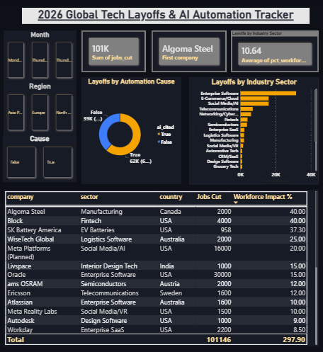

# 2026 Global Tech Layoffs & AI Automation Tracker: End-to-End Data Pipeline

A full-stack data analytics project showcasing data programmatic cleaning, engineering, and executive dashboard design. This project takes raw workforce disclosure data, refines it via Python, and delivers interactive business intelligence reporting.

##  Project Architecture & Workflow

1. **Data Ingestion & Cleaning (Python / Jupyter Notebook):** - Managed structural anomalies, handled missing fields, and formatted raw strings.
   - Standardized irregular date formats into uniform calendar attributes.
   - Engineered boolean filters to map direct AI-cited workforce changes.
2. **Data Export:** Generated an optimized relational dataset (`cleaned_layoffs_data.csv`) for BI consumption.
3. **Data Visualization (Power BI):** - Constructed a custom dark-mode interface utilizing clean canvas grid layouts.
   - Set up customized KPI metric blocks calculating total impact, company counts, and corrected statistical averages.
   - Built interactive comparative tracking charts focusing on industrial sector distribution ratios.

##  Repository File Guide
- `/raw_layoffs_data.csv`: The unrefined dataset tracking workforce metrics.
- `/layoffs_data_cleaning.ipynb`: The core Python cleaning script containing processing logic.
- `/cleaned_layoffs_data.csv`: The polished data output fueling the visuals.
- `/AI_Layoffs_Dashboard_2026.pbix`: The final operational Power BI application file.

## 🚀 Key Visual Insights

